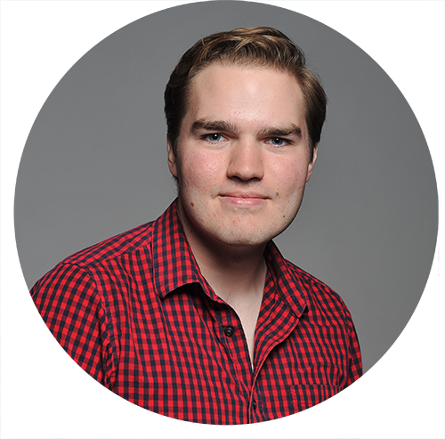

SEI Theater is more than your traditional non-profit theater company, and its board of directors and staff reflect that in the breadth of their experience and expertise.

SEI Staff

 

Kevin M. Karol
 

Artistic Director
 
Kevin M. Karol graduated from Carnegie Mellon University's BCSA program, studying the intersection of theatrical directing and computer science.  In addition to serving as SEI's Artistic Director, Kevin works on behavior systems for <a href="https://anki.com/en-us">Anki</a> in San Francisco.

 

 

Akiva Krauthamer
 

Director of Digital Products
 
Akiva Krauthamer graduated from Carnegie Mellon University with a major in Theatrical Media Design and a minor in Physical Computing. Akiva works across disciples including theatre, interactive installations, themed entertainment, video games and computational art to find meaning at the intersection of art and technology. Akiva currently works at Universal Creative as a member of the Advanced Technology Group.

 

Kate Robinson
 

Director of Artist Relations
 
Kate Robinson recently graduated from Carnegie Mellon University’s School of Drama with a focus in Dramaturgy. While there, she pursued work around sustainability and mental health awareness. Currently she works in the literary department at Marin Theatre Company, sharpening her skills in New Play Development and Literary

Management.

